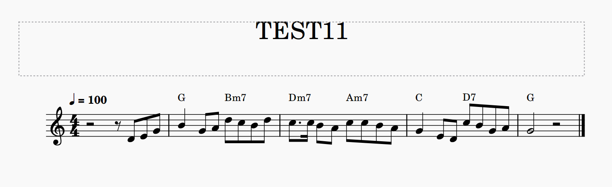

## 概要
本システムでは、リードシート形式のmusicXMLファイルを入力とし、それに基づいて主旋律と和音を同時に演奏するタブ譜の生成を行う。



## 必要なライブラリ
本システムを実行するために、いくつかのライブラリをインストールする必要があるため、以下のコマンドをプログラムを実行するフォルダでインストールする。

```
pip install music21
pip install copy
```

music21のインストールの詳細は、[こちら](https://zenn.dev/kthrlab_blog/articles/1686fd19dab5b9)から見て頂きたい。

## 説明
各Pythonファイルの役割と、ファイル内の主要な関数の説明を記載する。

### [main](main.py)
このファイルでは、`XML/`にあるmusicxmlファイルを読み取り、タブ譜の生成を行う。今回は例として、`XML/TEST11.musicxml`を使用する。
処理の流れは以下の通りである。

| `main()` | musicxmlを読み込み、下記処理後にタブ譜のmusicxmlを出力する |
| --- | --- |
| `getNotes()` | musicxmlから旋律情報とコード情報を取得する |
| `makeTabInfo()` | `Viterbi.py`から取得した運指情報を、music21の形式に書き直す |
| `makeTab()` | `makeTabInfo()`で作成した情報を、musicxmlに変換する |

### [state](state.py)
このファイルでは、考えられる運指情報（押弦箇所が2以下）や、ギターの指板の情報を作成する。
処理の流れは以下の通りである。

| `makeObserve()` | 押弦箇所が2以下の運指情報を作成する |
| --- | --- |
| `temp_forms()` | 基本的な押さえ方のデータを作成し、運指情報を作成する |
| `guitar_frets()` | ギターの指板をデータに変換 |


### [add state](add_state.py)
このファイルでは、`state.py`で作成できなかった押弦箇所が3以上の運指情報を、`temp_forms()`で準備した基本的な押さえ方の情報から作成する。
処理の流れは以下の通りである。

| `make_many_states()` | `temp_forms()`の運指情報に対していくつか変更を行う |
| --- | --- |
| `add_sound()` | 演奏する音を追加する |
| `ch2openst()` | 運指情報のいずれかを開放弦に変更する |
| `ch2rest()` | 運指情報のいずれかを休符に変更する |
| `ch_fingering_position()` | 運指情報にある指の中から、移動可能な指を移動させる |


### [Viterbi](Viterbi.py)
このファイルでは、`state.py`, `add_state.py`で作成された運指情報をもとにビタビアルゴリズムで最適な運指情報を探索する。
処理の流れは以下の通りである。

| `viterbi()` | ビタビアルゴリズムの本体 |
| --- | --- |
| `next_state()`| ビタビアルゴリズムの内部。遷移コストと出力コストの計算を行う |
| `startCost()`| 初期コストを計算する |
| `transmatCost()`| 遷移コストを計算する |
| `emmisionCost()`| 出力コストを計算する |


### [make XML](make_XML.py)
このファイルでは、得られた運指情報をmusicxml形式に変換する。

